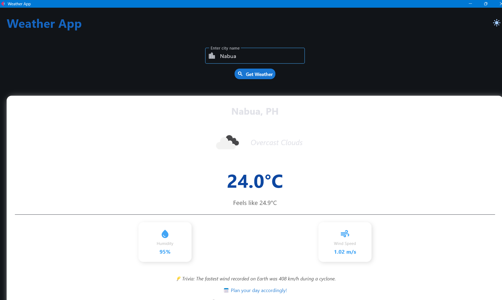
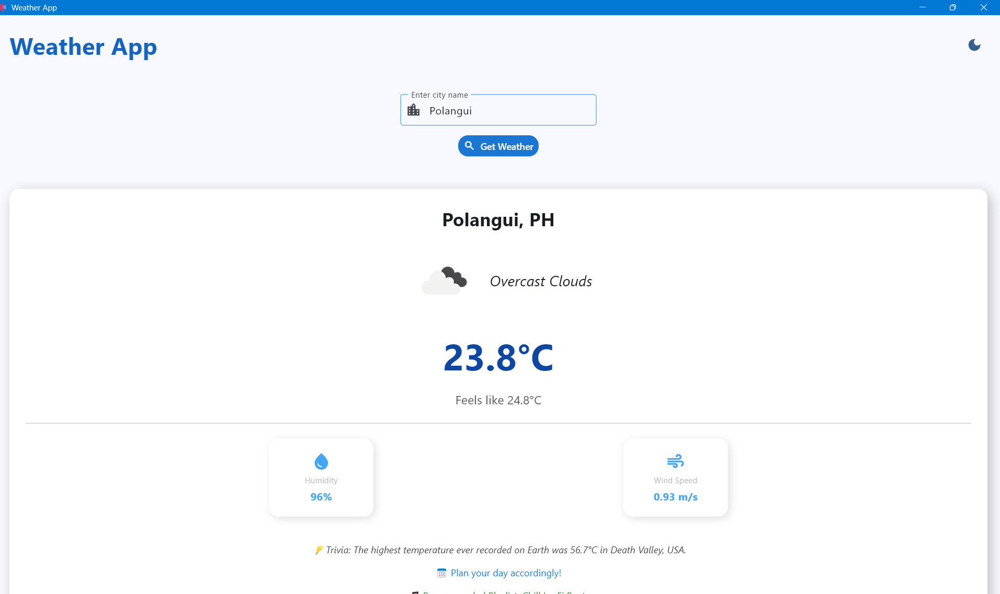

# Weather Application - Module 6 Lab

## Student Information
- **Name**: Rhea Lizza B. Sanglay
- **Student ID**: 231002341
- **Course**: BSCS
- **Section**: 3A

## Project Overview
The Weather Application allows users to search for any city worldwide and view current weather information. It shows real-time temperature, humidity, wind speed, weather description, and a weather icon. The app also includes enhanced features such as trivia, music recommendations, and calendar reminders based on the current weather. Users can toggle between light and dark modes, and the UI adapts its colors dynamically according to the weather conditions.

## Features Implemented
trivia, music recommendations, and calendar reminders
### Base Features
- [✅] City search functionality
- [✅] Current weather display
- [✅] Temperature, humidity, wind speed
- [✅] Weather icons
- [✅] Error handling
- [✅] Ehanced UI with Material Design
- [✅] Trivia, music recommendations, and calendar reminders
- [✅] Professional layout

### Enhanced Features
1. **Dark Mode Toggle**
   - This feature allows users to switch between light and dark themes for better readability and comfort during night usage.
   - Chosen to improve user experience and accessibility.
   - Challenge: Ensuring all UI elements respond to theme changes. Solved by toggling page.theme_mode and updating the UI dynamically.

2. **Weather-Based Trivia, Music, and Calendar Suggestions**
   - Displays random trivia about weather, recommends a music playlist, and suggests a calendar reminder depending on the current weather conditions.
   - Chosen to make the app more engaging, fun, and informative for the user.
   - Challenge: Displaying dynamic content that changes based on weather type. Solved by using helper functions (get_weather_trivia(), recommend_music(), suggest_calendar_event()) that map weather conditions to content.

## Screenshots
-
-
-

## Installation

### Prerequisites
- Python 3.8 or higher
- pip package manager

### Setup Instructions
```bash
# Clone the repository
git clone https://github.com/<username>/cccs106-projects.git
cd cccs106-projects/mod6_labs

# Create virtual environment
python -m venv venv
source venv/bin/activate  # On Windows: venv\Scripts\activate

# Install dependencies
pip install -r requirements.txt

# Create .env file
cp .env.example .env
# Add your OpenWeatherMap API key to .env
