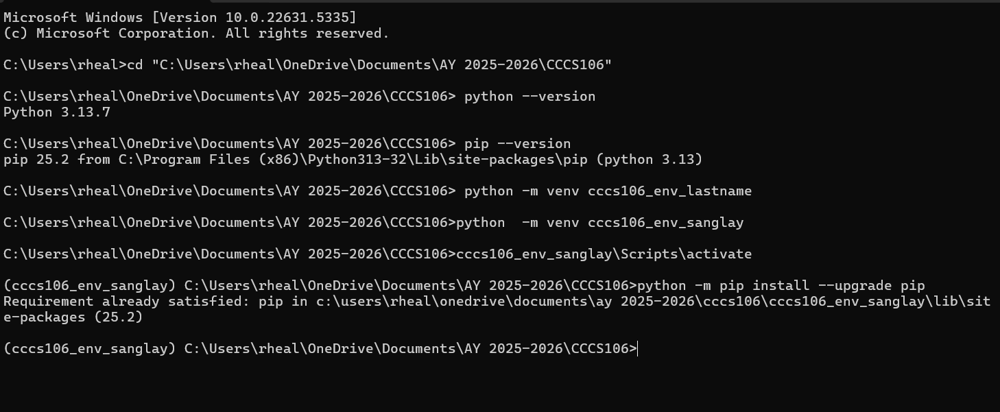
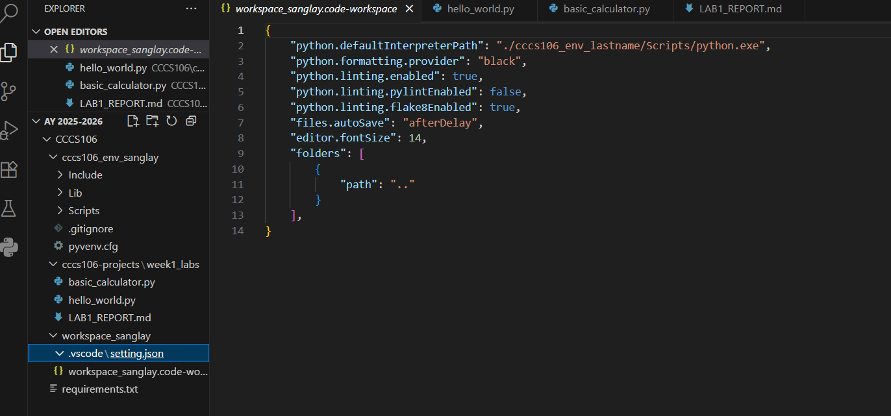
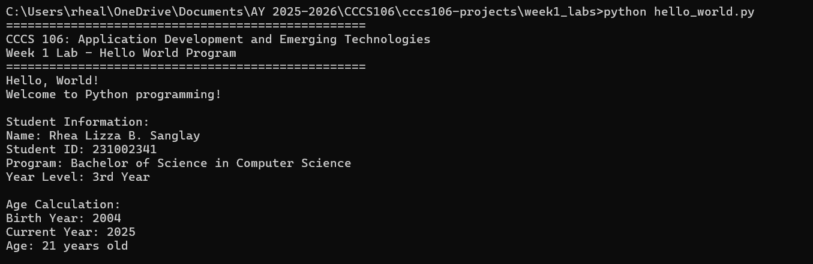
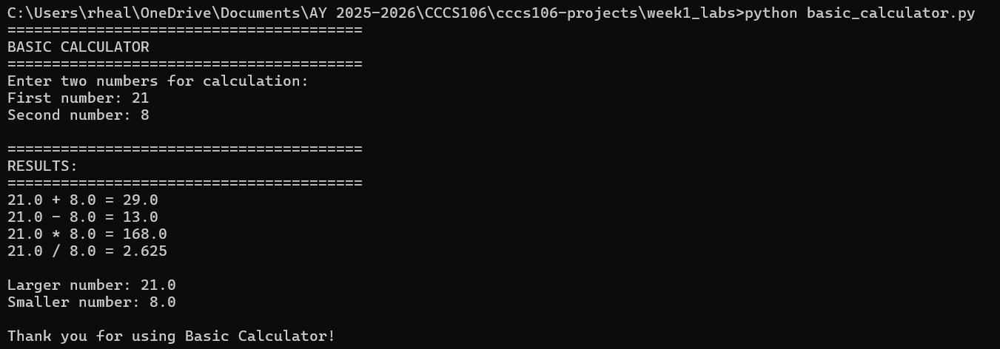

# Lab 1 Report: Environment Setup and Python Basics

**Student Name:** [Rhea Lizza B. Sanglay]
**Student ID:** [231002341]
**Section:** [BSCS - 3A]
**Date:** [August 31, 2025]

## Environment Setup

### Python Installation
- **Python Version:** 3.13.7
- **Installation Issues:** None
- **Virtual Environment Created:** ✅ cccs106_env_sanglay

### VS Code Configuration
- **VS Code Version:** 1.82.0
- **Python Extension:** ✅ Installed and configured
- **Interpreter:** ✅ Set to cccs106_env_sanglay/Scripts/python.exe

### Package Installation
- **Flet Version:** 0.28.3
- **Other Packages:** 
## List any additional packages
 - anyio==4.10.0\
 - certifi==2025.8.3\
 - flet==0.28.3\
 - h11==0.16.0\
 - httpcore==1.0.9\
 - httpx==0.28.1\
 - idna==3.10\
 - oauthlib==3.3.1\
 - repath==0.9.0\
 - six==1.17.0\
 - sniffio==1.3.1

## Programs Created

### 1. hello_world.py
- **Status:** ✅ Completed
- **Features:** Student info display, age calculation, system info
- **Notes:** Changes of student name, date, student_id, program and birthdate. And, I had to double-check the path to make sure the script was inside the week1_lab\.

### 2. basic_calculator.py
- **Status:** ✅ Completed
- **Features:** Basic arithmetic, error handling, min/max calculation
- **Notes:** None

## Challenges and Solutions

Challenges: Running hello_world.py it gave "no directory" or "file not found"
Solutions: Need to moved the file in to the correct path.

## Learning Outcomes

 - I understand on to keep organized my Vs Code project.
 - Learned on how to install python and set up the virtual environment.
 - Understood how to handle errors (e.g., invalid inputs, division by zero) in Python programs. 

## Screenshots

-   
-   
-   
- 
