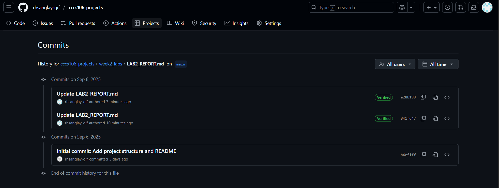
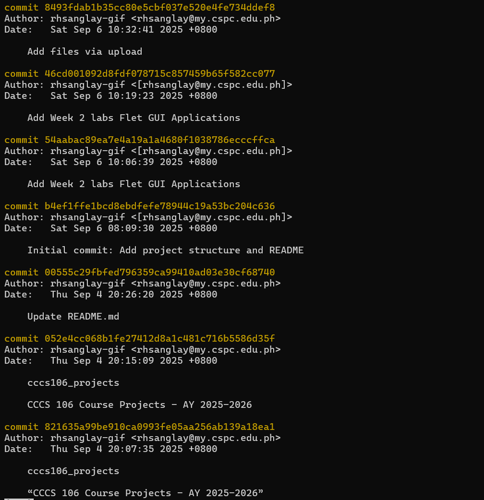
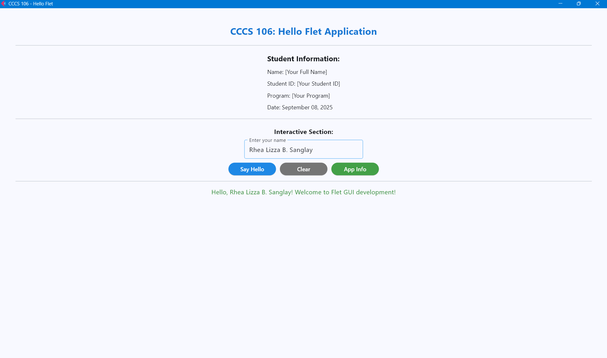
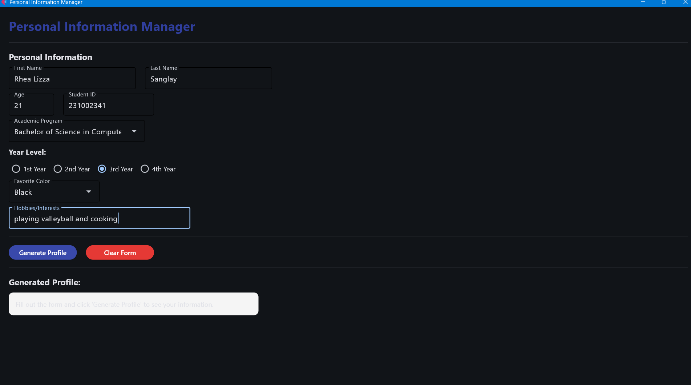
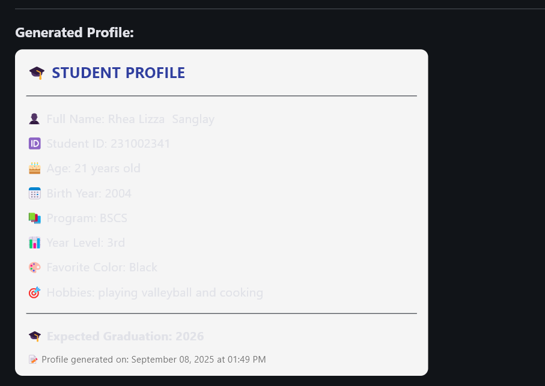

# Lab 2 Report: Git Version Control and Flet GUI Development

**Student Name:** Rhea Lizza B. Sanglay

**Student ID:** 231002341

**Section:** 3A

**Date:** September 3, 2025

## Git Configuration

### Repository Setup
- **GitHub Repository:** [(https://github.com/rhsanglay-gif/cccs106_projects.git)]
- **Local Repository:** ✅ Initialized and connected
- **Commit History:** 42 commits, I edited some changes in my Lab1 and Lab2 reports.
### Git Skills Demonstrated
- ✅ Repository initialization and configuration
- ✅ Adding, committing, and pushing changes
- ✅ Branch creation and merging
- ✅ Remote repository management

## Flet GUI Applications

### 1. hello_flet.py
- **Status:** ✅ Completed
- **Features:** Interactive greeting, student info display, dialog boxes
- **UI Components:** Text, TextField, Buttons, Dialog, Containers
- **Notes:** Learned how to handle user input and display dynamic text using Flet. The main challenge was properly linking button events with dialog displays.

### 2. personal_info_gui.py
- **Status:** ✅ Completed
- **Features:** Form inputs, dropdowns, radio buttons, profile generation
- **UI Components:** TextField, Dropdown, RadioGroup, Containers, Scrolling
- **Error Handling:** Input validation and user feedback
- **Notes:** The biggest challenge was validating inputs (like empty fields or invalid selections). I solved this by adding conditional checks and showing error messages through dialogs.

## Technical Skills Developed

### Git Version Control
- Understanding of repository concepts
- Basic Git workflow (add, commit, push)
- Branch management and merging
- Remote repository collaboration

### Flet GUI Development
- Flet 0.28.3 syntax and components
- Page configuration and layout management
- Event handling and user interaction
- Modern UI design principles

## Challenges and Solutions

- Challenge 1: Push failed due to wrong remote URL 
- Solution: Used git remote set-url origin <correct URL>

- Challenge 2: Difficulty in dialog positioning in hello_flet.py 
- Solution: Used proper page.dialog reference before opening

- Challenge 3: Input form validation not working properly 
- Solution: Added conditional checks before displaying profile output

- Challenge 4: Having difficulties when I'm adding, pushing and connecting to github.
- Solutions: I ask for help to one of my classmates on how they do it.

## Learning Outcomes

From this lab, I learned the importance of version control in managing code changes and collaborating on projects. I also developed hands-on skills in creating Flet GUI applications, understanding how to design interactive and user-friendly interfaces. Overall, I became more confident in both coding practices and using GitHub as a collaboration tool.

## Screenshots

### Git Repository
-
- 

### GUI Applications
- 
- 
-

## Future Enhancements

- Add themes and color customization to the GUI for better design

- Enhance form validation with regex for stricter input rules

- Implement profile saving to a file (JSON/CSV)

- Extend the project with more GUI applications (e.g., grade calculator, task manager)

